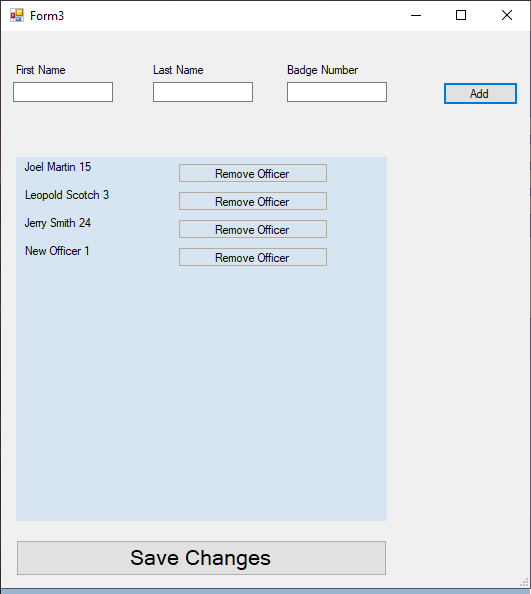
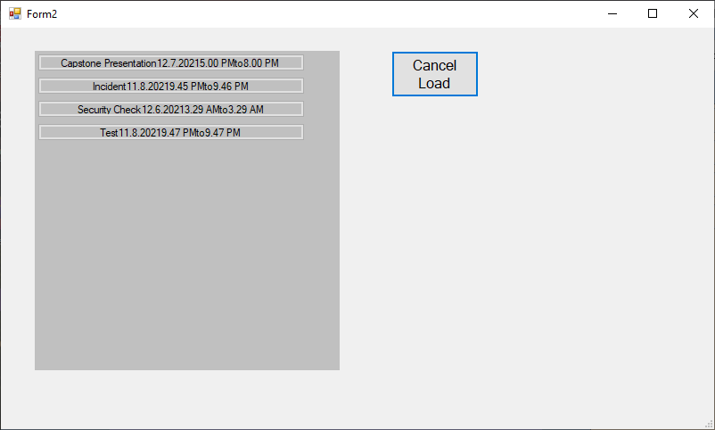

# Capstone-Project--Log-keeping-software

## My capstone project for Northeastern State University. 

### Software designed to be a security or law enforcement dispatcher's log keeping software.

The software is an executable application, with the GUI and its related fuctions built using Microsoft Visual Studios. The application provides a user interface, which is used to create log entry objects, which are stored as .csv files upon pressing the "Save Log" button. Upon launch the application will check to see if the location to store the .csv files has been created. If it does not exist it is created. The date and start time boxes will also be filled upon launch, using the computer's clock. If officers have been previously added to the Officers.csv file stored on the C: drive, they will be leaded into the "Available Officers" box upon launch. 

The user is meant to enter data into the text boxes, and add officers to the logentry by clicking on them. All entered data, and dispatched officers will be stored to a .csv file when the "Save Call" button is pressed.  If you press the "Add/Remove Officers" button, it launches a new page which allows the user to add officers to the Officers.csv file. The "Load Call" button launched a page which allows the user to load a previously stored logentry to the main page.

#### The main page displayed on launch

#### The "Add/Remove Officers" page

User's simple enter the new officer's first name, last name, and badge number into the boxes, and press "Add" to add the officer to the box below. Officer's can also be removed with the "Remove Officer" botton next to their right. The light blue box represents the contents of the "Officers.csv" file. No changes will be commited to the file unless the "Save Changes" button is pressed. 

#### The "Load Call" page

When this page is launched the C:/DispatchFiles/LogEntries directory is checked, and the name of every .csv file at that directory is loaded in as a button. When one of those buttons is pressed the data from that file is loaded into a logentry object. The main page is then launched and the data from that object is loaded into the boxes. Changes can then be made to that lognetry, and those changes can be applied to the .csv file with the "Save Log" button. The "Cancel Load" button will return the user to the main page without changing the content of the boxes.
