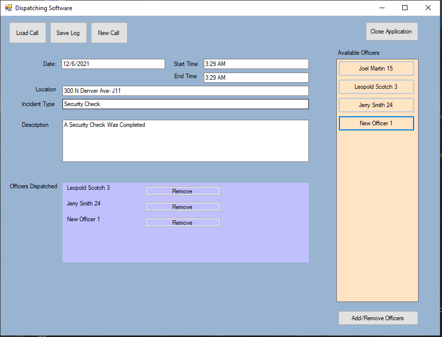

# Capstone-Project--Log-keeping-software

## My capstone project for Northeastern State University. 

### Software designed to be a security or law enforcement dispatcher's log keeping software.

The software is an executable application, with the GUI and its related fuctions built using Microsoft Visual Studios. The application provides a user interface, which is used to create log entry objects, which are stored as .csv files upon pressing the "Save Log" button. Upon launch the application will check to see if the location to store the .csv files has been created. If it does not exist it is created.

#### The main page displayed on launch

